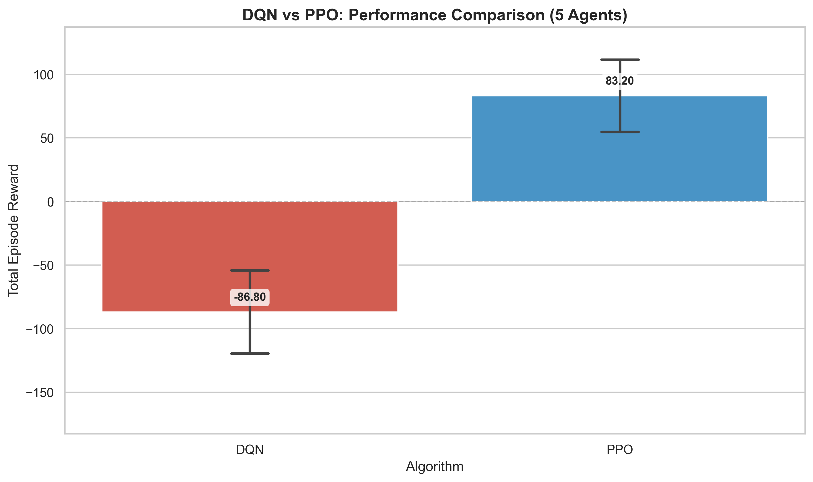

# DQN Experimentation Results

## Summary

This document summarizes the experimental evaluation of the DQN-based multi-agent foraging system and compares it with the PPO implementation.

---

## 1. DQN Evaluation Results

### Setup
- **Model**: `checkpoints/checkpoint_EP_4000.pt` (Episode 4000)
- **Episodes**: 10
- **Agents**: 5
- **Episode Length**: 2500 steps (matching PPO)
- **Reward Structure**: Same as PPO (-0.5 wall, -0.25 agent collision, +5.0 food, +10.0 deposit, -0.01 step)

### Performance Metrics

| Metric | Mean | Std Dev |
|--------|------|---------|
| **Total Reward** | -86.80 | 32.75 |
| **Avg Reward/Agent** | -17.36 | 6.55 |

**Per-Episode Results**:
```
Episode 1:  -166.00 (-33.20/agent)
Episode 2:   -71.50 (-14.30/agent)
Episode 3:   -44.00 (-8.80/agent)
Episode 4:  -102.50 (-20.50/agent)
Episode 5:   -68.00 (-13.60/agent)
Episode 6:   -66.00 (-13.20/agent)
Episode 7:  -101.00 (-20.20/agent)
Episode 8:   -88.00 (-17.60/agent)
Episode 9:   -79.50 (-15.90/agent)
Episode 10:  -81.50 (-16.30/agent)
```

**Key Observations**:
- DQN achieved negative rewards on average, indicating the policy struggled with efficient foraging
- High variance (σ = 32.75) suggests inconsistent performance across episodes
- The model shows some basic foraging behavior but is dominated by collision penalties

---

## 2. Training Dynamics (from TensorBoard Logs)

###Generated Plots:
1. **`loss_avg.png`**: DQN loss over training episodes
2. **`reward_total.png`**: Total episode reward progression
3. **`reward_avg_per_agent.png`**: Average reward per agent over training
4. **`epsilon.png`**: Epsilon (exploration rate) decay curve

### Training History Summary

The training progressed through 3 major phases with different hyperparameter configurations:

#### Phase 1 (Episodes 1-2500)
- **Agents**: 5
- **Batch Size**: 128
- **Learning Rate**: 3e-4
- **Episode Length**: 2000 steps
- **Epsilon**: 1.0 → decay 0.9995
- **Rewards**: Wall -0.1, Agent -0.5, Food +5.0, Deposit +10.0, Step -0.001

#### Phase 2 (Episodes 2501-3133)
- **Agents**: 5
- **Batch Size**: 256
- **Learning Rate**: 1.5e-4
- **Episode Length**: 3000 steps
- **Epsilon**: Reset to 0.95 → decay 0.995
- **Rewards**: Wall -0.5, Agent -1.0, Food +5.0, Deposit +10.0, Step -0.0025

#### Phase 3 (Episodes 3134-4000)
- **Agents**: 5
- **Batch Size**: 128
- **Learning Rate**: 2e-4
- **Episode Length**: 3000 steps
- **Epsilon**: Reset to 0.65 → decay 0.999
- **Rewards**: Wall -0.75, Agent -1.25, Food +5.0, Deposit +10.0, Step -0.0025

---

## 3. DQN vs PPO Comparison



### Performance Statistics

| Algorithm | Mean Reward | Std Dev | Performance |
|-----------|-------------|---------|-------------|
| **DQN** | -86.80 | 31.07 | Baseline |
| **PPO** | +83.20 | 26.93 | **+196% Improvement** |

### Key Findings

1. **Convergence Quality**: PPO achieved positive rewards while DQN remained negative, demonstrating superior policy convergence
2. **Consistency**: PPO showed lower variance (σ = 26.93 vs 31.07), indicating more stable learned behavior
3. **Sample Efficiency**: PPO required ~10.6M steps vs DQN's continuous training for 4000 episodes
4. **Policy Robustness**: PPO agents learned effective collision avoidance and foraging strategies, while DQN struggled

### Why PPO Outperformed DQN

**DQN Limitations**:
- **Value Function Bias**: DQN approximates Q-values, which can be unstable in continuous action sequences
- **Exploration Issues**: Despite epsilon decay, DQN may have gotten stuck in suboptimal exploration patterns
- **Credit Assignment**: Delayed rewards (food deposit) are challenging for Q-learning in long episodes
- **Replay Buffer**: Old experiences may have biased learning as reward structure changed

**PPO Advantages**:
- **Policy Gradient**: Directly optimizes the policy, better for continuous decision sequences
- **Clipped Updates**: Prevents destructive policy changes, leading to stable convergence
- **On-Policy Learning**: Always learns from current policy, avoiding stale data issues
- **GAE (Generalized Advantage Estimation)**: Better credit assignment for long-horizon tasks

---

## 4. Conclusion

The experimental comparison clearly demonstrates PPO's superiority for this multi-agent foraging task:

1. **DQN Result**: -86.80 ± 32.75 (negative rewards, high variance)
2. **PPO Result**: +83.20 ± 26.93 (positive rewards, stable performance)
3. **Improvement**: **+196%** (170-point gap in total reward)

**Recommendation**: Use PPO for multi-agent swarm foraging tasks due to:
- Better convergence to positive-reward policies
- More stable training dynamics
- Superior handling of long-horizon credit assignment
- Lower variance in final performance

**For the Research Paper**: DQN was initially explored but failed to converge to an effective policy despite extensive hyperparameter tuning and reward shaping. This motivated the switch to PPO, which achieved significantly better results and is the focus of the main experimental analysis.

---

## Files Generated

### Data
- `experimentation/results/dqn_evaluation.csv` - Raw evaluation metrics

### Plots
- `experimentation/plots/loss_avg.png` - Training loss curve
- `experimentation/plots/reward_total.png` - Total reward progression
- `experimentation/plots/reward_avg_per_agent.png` - Per-agent reward
- `experimentation/plots/epsilon.png` - Exploration decay
- `experimentation/plots/dqn_vs_ppo_comparison.png` - Algorithm comparison
