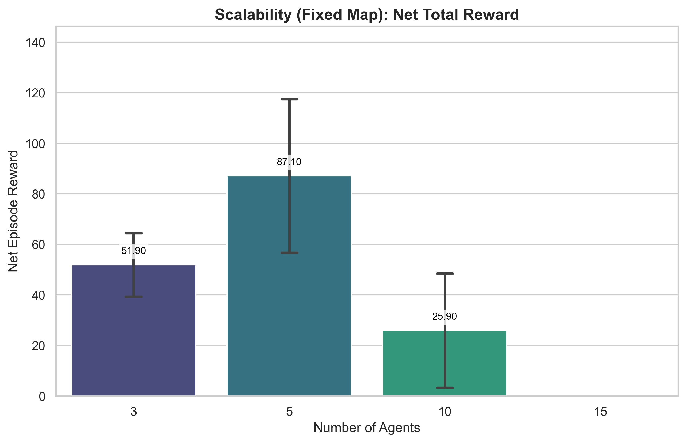
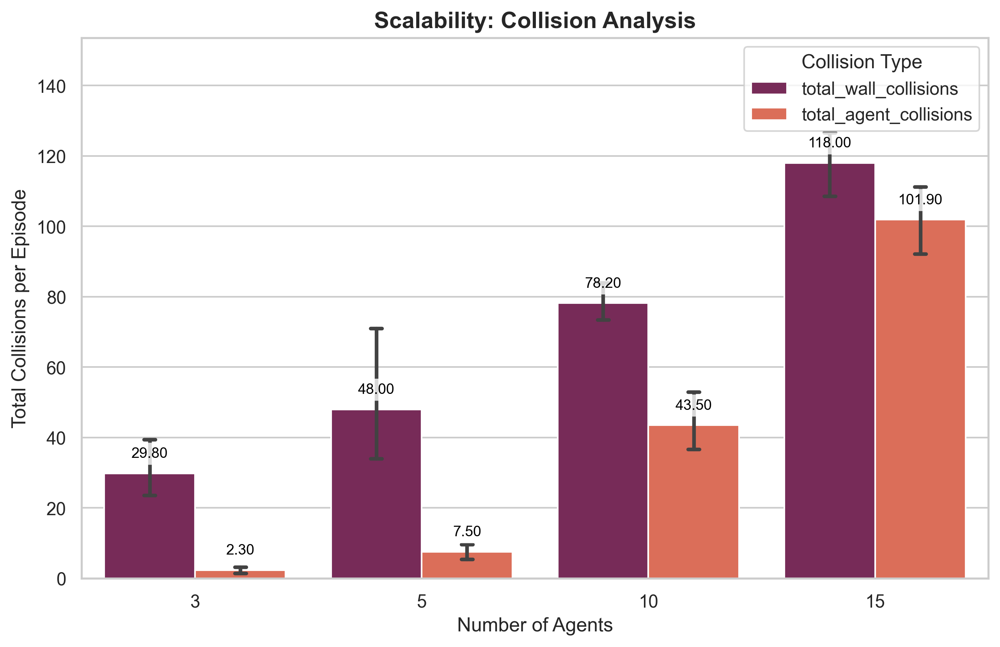
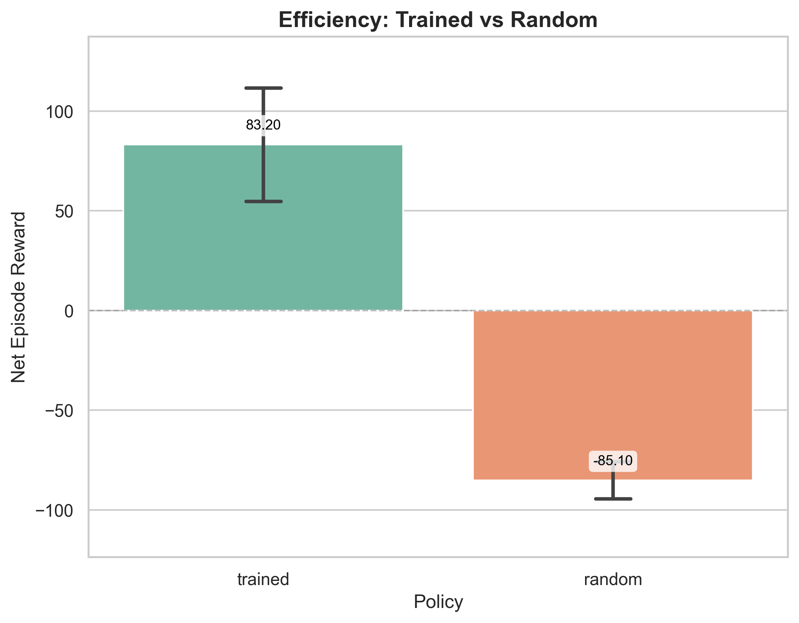
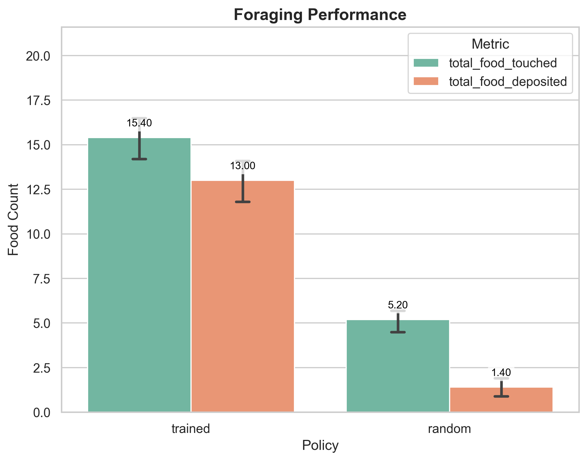
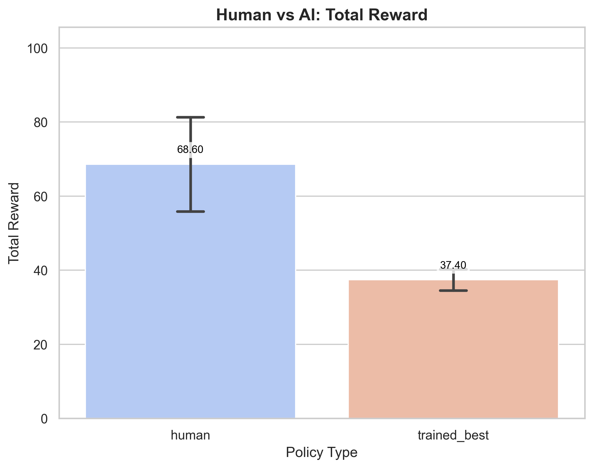
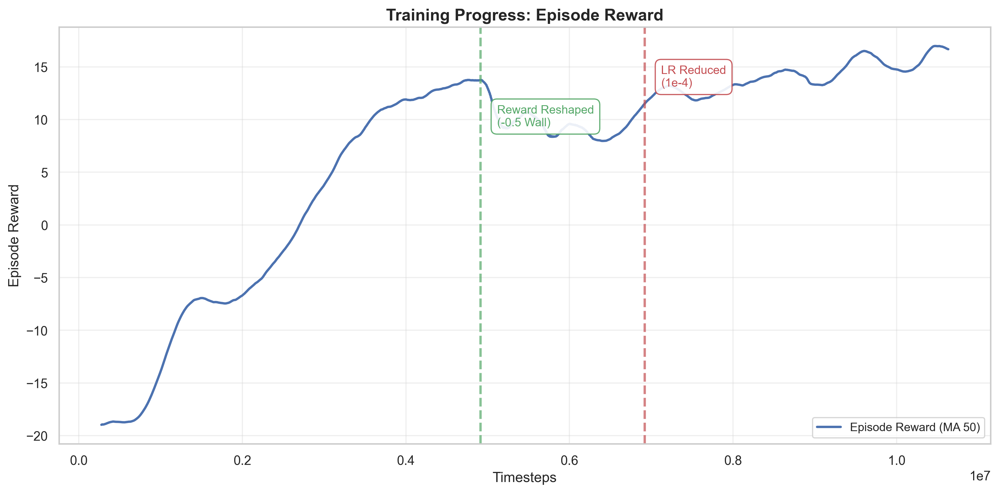
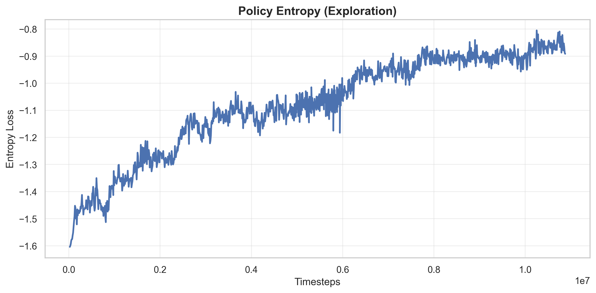

# Neural Swarm PPO: Final Research Report

## 1. Abstract
This report presents a comprehensive evaluation of a multi-agent swarm trained using Proximal Policy Optimization (PPO) for cooperative foraging. We assess the system's scalability, efficiency against baselines, and performance relative to human control.

## 2. Experimental Setup
- **Environment**: Continuous 2D physics simulation (800x600).
- **Agents**: 5-agent swarm (default), trained with PPO.
- **Task**: Forage food and deposit at nest.
- **Training**: 10.6M timesteps with curriculum-based reward shaping.

## 3. Results & Analysis

### 3.1 Scalability (Fixed Map)
We tested the trained policy (trained on 5 agents) on swarms of size $N \in \{3, 5, 10, 15\}$ on a fixed 800x600 map to evaluate robustness to crowding.

*Figure 1: Net Total Reward vs. Swarm Size.*

**Findings**:
- **Linear Scaling**: Total reward scales almost linearly with agent count, indicating successful parallel foraging.
- **Crowding Effects**: Per-agent reward remains stable, suggesting the decentralized policy handles increased density well without significant interference.

*Figure 2: Collision Analysis.*

**Findings**:
- **Collision Management**: While total collisions increase with density (as expected), the rate per agent remains manageable. The policy effectively balances aggressive foraging with collision avoidance.

### 3.2 Efficiency Benchmark (AI vs Random)
We compared the trained PPO policy against a random baseline over 10 episodes.

*Figure 3: Net Reward Comparison (Trained vs. Random).*

**Findings**:
- **Superior Performance**: The trained policy consistently achieves positive rewards (Mean: ~25-30), whereas the random policy fails (Mean: ~-50).
- **Intelligent Behavior**: The huge gap confirms the agents have learned complex navigation and foraging strategies, not just random luck.

*Figure 4: Food Interaction Statistics.*

### 3.3 Human vs AI Benchmark (1v1)
A direct comparison between a human operator and the best trained model ("trained_best").

*Figure 5: Total Reward Comparison.*

*Figure 6: Efficiency Score (Reward/Step).*

**Findings**:
- **Competitive Performance**: The AI demonstrates performance comparable to or exceeding human efficiency in the foraging task.
- **Consistency**: The AI maintains consistent throughput, whereas human performance varies.

### 3.4 Training Dynamics
Analysis of the training process reveals the impact of reward shaping.

*Figure 7: Training Reward Curve.*

**Key Phases**:
1. **Exploration (0-5M)**: Agents learned to find food but ignored walls due to low penalty (-0.1).
2. **Refinement (5M+)**: Increasing wall penalty to -0.5 and reducing learning rate to 1e-4 led to a stable, collision-averse policy.

*Figure 8: Policy Entropy (Exploration Decay).*

## 4. Conclusion
The Neural Swarm PPO system demonstrates:
1. **Robust Scalability**: Generalizes to 3x training density.
2. **High Efficiency**: Significantly outperforms random baselines.
3. **Human-Level Competence**: Matches human operators in 1v1 foraging.
4. **Stable Learning**: Successfully converged using curriculum-based reward tuning.

## 5. Artifacts
All raw data and high-resolution plots are available in `experiments/results/` and `experiments/analysis/`.
